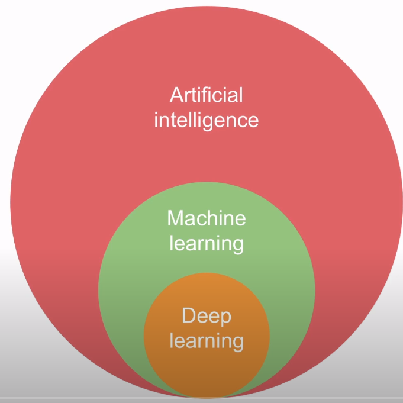
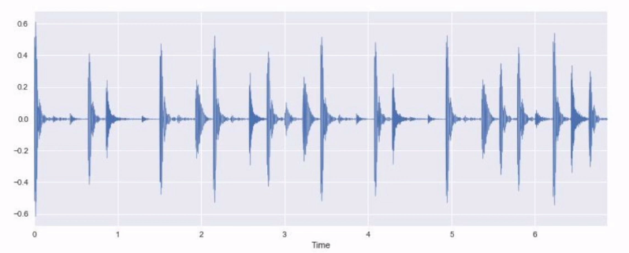
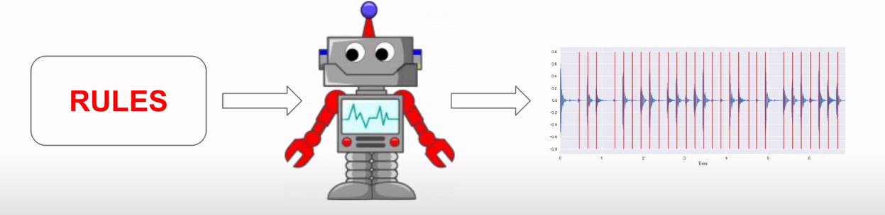
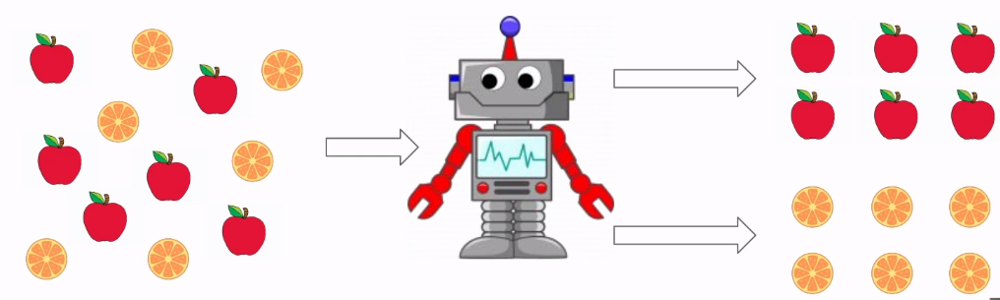
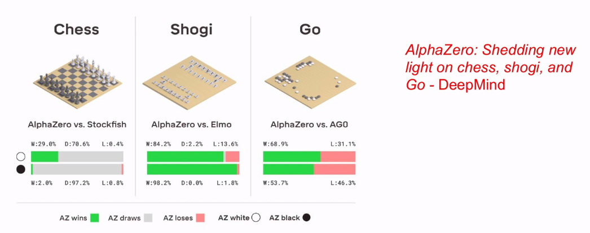

# AI, machine learning and deep learning

## Relationship between AI, Machine learning and Deep Learning

## Defining Artificial Intelligence

> The designing and building of intelligent agents that receive percepts from the environment and take actions that affect that environment
> 

Intelligent agent = Rational agent

Rationality = Acting to achieve one's goals, given one's beliefs

### Artificial intelligence

- Many AI techniques/algorithms
- Evolutionary algorithms
- Expert systems
- Search (e.g., A*)
- Machine learning
- ...

### Machine learning (ML)

- Computer performs a task without using explicit instructions
- Computer learns from data

## ML vs expert system for onset detection

- Onset detection task: identify start of a musical note

### Expert system: Onset detection

Relies on rules we as developers have provided it.

EG:

- If the amplitude is more than 0.2 or less than -0.2 you could have an onset

We provided the rules to the system, the system does what we literally told it to do

### ML onset detection: Training

Prove the ML system with a bunch of data (samples) of waveforms with identified onsets (labeled). The machine learning system is able to extract the rules from that data by itself. We are not passing any rules to the machine ourselves.

## ML paradigms

"flavours"

- Supervised learning
- Unsupervised learning
- Reinforcement learning
- ...

### Supervised learning

- Model trained with labelled data (onset detection example)
- We give the solution along with the problem itself in the form of labeled training data
- It tweaks its' weights based on the training data

### Unsupervised learning

- Model draws inferences from unstructured data

### Reinforcement learning

- Agent takes actions in virtual environment and learns through rewards and punishment

## ML algorithms

- Logistic regression
- Linear regression
- Random forest
- KNN
- Support vector machines
- Neural network
- ...

### Neural network

1. Input layer
    
    Used for providing the different data into the network
    
2. Hidden layer(s)
    
    Processes the information
    
3. Output layer
    
    Used to get the inferences from the NN
    
- NN are the algorithms of choice for deep learning

### Deep learning

- ML subset
- (Deep) neural networks
- More than 1 hidden layer

## Traditional ML vs DL

- Feature engineering vs end-to-end
    
    Feature engineering means extracting features(details, identifiers) which we pass into the ML algorithm. It is very important to understand which features are important.
    **In deep learning it's different**. We have an **end-to-end approach**. We pass in raw data directly into the ML algorithm. Without any feature extraction the DL model will hopefully be able to figure out the different rules to hopefully complete the eg. regression task.
    
- (Relatively) small dataset vs large dataset
- Less computation intensive vs very resource intensive
- Ideal for "simple" problems vs ideal for "complex" problems

### When should you use DL?

- Very large dataset
- Complex problem where traditional ML fails
- Access to extensive computational resources

### DL applications in audio

- Speech recognition
- Voice-based emotion classification
- Noise recognition
- Musical genre, instrument, mood classification
- Music tagging
- Music generation
- ...

## Takeaway points

- AI = Building rational agents that act to achieve their goals given their beliefs
- ML is a subset of AI
- There are different flavours of ML and many ML algorithms
- DL is a subset of ML using DNNs (deep neural networks)
- DL isn't always the way to go!