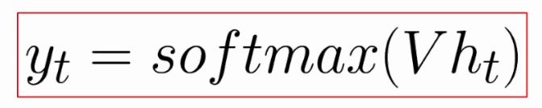

# Recurrent Neural Networks Explained

## RNNs

- Order is important
- Variable length
- Used for sequential data
- Each item is processed in context
- Ideal for audio/music

## Univariate time series


22050 (Sample rate) * 9 (seconds)

## Multivariate time series


Interpreting MFCCs as a multivariate time series.

We have (in this case) 9 intervals. Each interval has 13 values. Each of the values represents a MFCC coefficient.

In this case we are talking about a **multi**variate time series because we have multiple measurements for each interval.

The relative dimension is given by the overal number of intervals (sample rate / hop length(usually 512) * 9 (num of seconds) and the second dimension is given by the number of MFCCs, which are 13.

These time series can be used by RNN

## Intuition

- Input data points one at a time
- Predict next step
- Prediction depends on previous data points

## RNN Architecture


A recurrent layer is a layer that is able to process sequential data in a sequential way. This will be covered later.

```
shape of X = [batch size, number of steps, number of dimensions]
```

## Recurrent layer


The cell is the most important part of the RNN.

Types of cells:

- Simple dense layer with hyperbolic tangent as the activation layer
- LSTM
- Gated recurrent unit
- ...

The cell is responsible for processing sequential data

1. Get input data (Xt)
2. Cell does some processing
3. Cell outputs:
    1. Ht (state vector / hidden state). Represents a hidden state of the cell at a certain point of time
    2. Yt. This is the actual output

The whole point is that the Ht is going to be reused at the next time in order to preserve context.

### Unrolling a recurrent layer


1. We pass in X0
2. X0 gets analyzed and processed in the cell
3. We get an output, H0. This is the state vector at this timestep series
4. We get an output, Y0.


1. We send in X1 as a datapoint
2. X1 is used in conjunction with H0 to process in the cell
3. The output is H1 and Y1


### Data shape

```
input:
[batch size, # steps, # dimensions] = [2, 9, 1]
```


We end at the 9th step, because that is specified in the 2nd value of our input array.


We are outputting as many outputs as the batch size.

```
output shape = [batch size, # steps, # units] = [2, 9, 3]
```

In simple RNNs the state vector (H) is equal to the Y output.

## Types of RNN

### Sequence to vector RNN


Here we are just waiting for this Y9 value, we ignore the Y values from the other steps.

If you want to generate a melody, you are interested in the last note.

### Sequence to sequence RNN


Here we consider as an output all the outputs at each timestamp. The idea is that we input a batch of sequences, and we also get a batch of sequences as an ouput.

This is a little less common than sequence to vector, and this is reflected in how Keras works. The default behaviour for simple RNN layers in Keras is Sequence to vector.

## Memory cell for simple RNN

- Dense layer
- Input = state vector + input data
- Activation function = *tanh*

### Why do we use tahn?

- Training RNNs is difficult
- Vanishing gradients + exploding gradients
- ReLU can explode
- *tanh* maintains values in [-1, 1]


## Backpropogation through time (BPTT)

- Error is back propogated through time
- RNN is unrolled and treated as a feedforward network
- Very deep network


While we train the network, we output predictions at each timestamp, and compare them to the targets.

We expect the targets to be the inputs but shifted towards the right by 1 step. 

At each timestep we calculate and backpropagate the error.

By doing so we stabilize the training process. If we have a big error at a specific timestep we can propagate the error and tweak the weights in the layer that has the most problems.


After all this we can drop the sequence to sequence predictions and just focus on the last prediction, which is usually what we want.

## The math behind an RNN

Let's focus on 1 timestamp.


U, W, V are weight matrices. We are going to use them to calculate the state vector and the output.

U is connected with the input

W is connected to the state vector

V connected with the dense layer, which enables us  to get to the output.


Let's first calculate ht.

It depends on xt (the current input) and ht-1 (the state vector for the previous timestamp)



Now that we have ht, we can calculate the output, which is a softmax activation function applied to ht.

Question: What do we learn when training a RNN?

Answer: We learn the two functions above. More specifically, the weight matrices U, W, V.

## Issues with RNNs

- No long-term memory
- Network can't use info from the distant past
- Can't learn patterns with long dependencies

To tackle these issues a specific type of RNN has been created, these are called LSTM, Long Short Term Memory networks