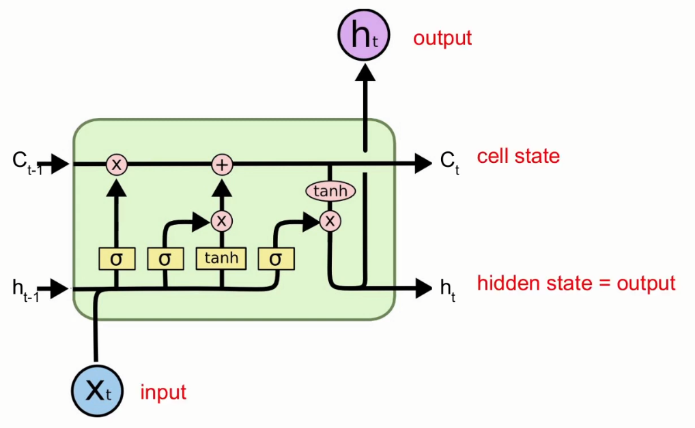
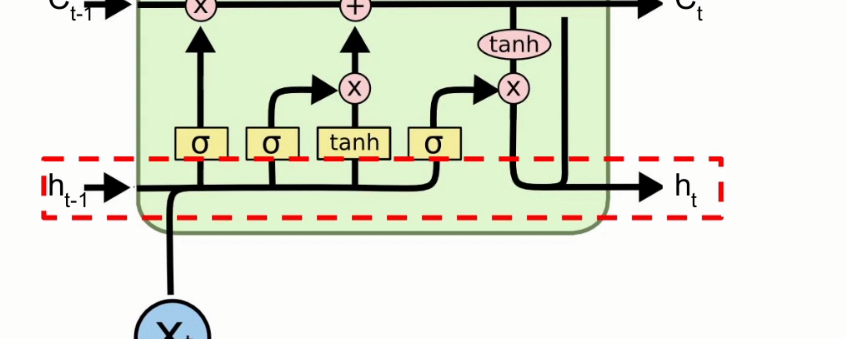
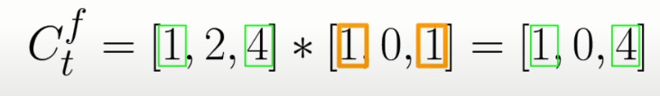
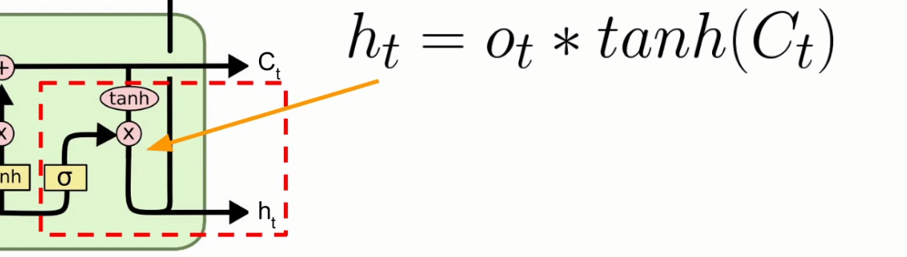

# Long Short Term Memory (LSTM) Networks Explained

## LSTM

- Special type of RNN
- Can learn long-term patterns
- Detects patterns with 100 steps
- Struggles with 100s and 1000s of steps

## Simple RNN vs LSTM

Simple RNN

LSTM

## LSTM Cell

- Contains a simple RNN cell
- Second state vector = cell state = long-term memory
- Forget gate
- Input gate
- Output gate
- Gates work as filters

Starting with the simple stuff, these things we already kind of know.

A new output is Ct.

Notice that our simple RNN cell is also in there. The input is Xt and Ht-1.

We can think of this hidden state as the short-term memory.

This cell state is responsible for the long-term memory.

- Cell state updated twice
- Few computations → stabilise gradients

The first `X` that the cell state comes across, decides what to forget (because maybe they are not that important)

The `+` decides what new info to remember (because maybe it is super important)

We will break down the 3 components:

- Forget
- Input
- Output

## Forget component

Ft is the result of the forget gate (sigmoid)

We concatenate the input at the current timestamp (Xt) with the hidden vector of the previous timestep (Ht-1). Then we apply a sigmoid function to those. 

`Bf` is the bias term

`Wf` is the weight matrix for the forget layer.

Once we do this we get a matrix which is the 'filter' for what we should forget

Remember, we are using a sigmoid function, which shrinks the output between 0 and 1. So all of the values in this Ft matrix will be between 0 and one.

Indexes that are closer to 0 are the relative indexes that we are going to forget, closer to 1 we remember.

But how do we forget?

We perform this element wise multiplication to forget. 

We take the cell state at Ct - 1 and perform an element wise multiplication with the Ft matrix.

To do this the matrices need to have the same dimension. 

The result is this `Ctf` which is a conventional way to say: This is the cell state from the previous timestep (Ct - 1) where we decide what to forget at this timestamp.

### Forget example

 This is how we would get `Ctf` in this example.

As you can see, we are keeping the information in green. Why is that?

It happens because our filter allows it to stay. It has decided that the `2` value from Ct-1 has to go, whereas the other values can stay (see the orange marked boxes).

So the second index has been dropped, it becomes zero

## Input component

Let's first process the input and get a matrix out of it. This will act like a filter on the simple RNN component.

We get `It` by applying a sigmoid function to concatenation of the input at the current timestamp (Xt) with the hidden vector of the previous timestep (Ht-1) (just like for the forget component).

We multiply this `Wi` once again and sum it with a bias term (`Bi`)

Next, we also need to get this `Ct'` (Ct prime) from the simple RNN component.

We get this by once again concatenating Xt with Ht-1.  But this time we are using a *tanh.*

Now that we have the two values, we need to calculate the element wise multiplication by `Ct'` and `It` . We are filtering `Ct'` with `It` the same way we've done in the forget component.

`It` is going to determine what is important to keep. 

The next step is to arrive at Ct. In order to do that we we do this element wise sum. We sum Ctf with Cti

Let's summarize all these different values

- Ctf = tells us what to forget from the previous state
- Cti = came out of the purple square, these are the new values. So what is important to add as new information.

## Output component

Once again we have another gate, which is the sigmoid layer.

We calculate the output filter by applying the sigmoid function, once again, to Ht-1 and Xt. We get Ot

What remains to do is arrive at Ht (purple).

We need to do another element wise multiplication of Ot times *tanh(Ct).*

At that point we take Ht and use it for two reasons. We use it for the hidden state, and we output it on top. (Green arrows

## LSTM variants

- Gated Recurrent Unit - GRU

