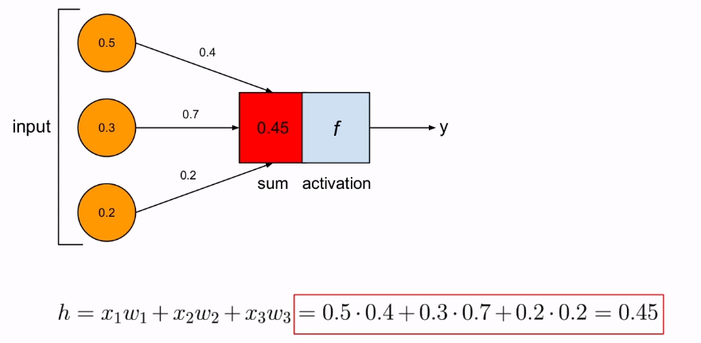

# Implementing an artificial neuron from scratch

### What we will learn

- Biological neurons
- Math behind the artificial neuron
- Implementing an artificial neuron with python

## Biological neuron


A neuron by itself is not super powerful. It becomes super powerful when you put millions together, like in our brain. Thanks to these neurons and these connections (trillions of connections of billions of neurons) we can walk, talk, and play sudokus.

## The artificial neuron


### The sum


x1*w1 + x2*w2 + x3*w3

### The activation


There are a lot of different activation functions

## The Sigmoid activation function


Left: graph of the function, right: formula

Why is it good?

- It's bounded between 0 and 1
- It's a very smooth function

It modulates all the inputs and the net input into an output limited by 0 and 1

## The artificial neuron with sigmoid activation function

1. Calculate the sum
    
    
    
2. Use the activation function *f*


## Python example of artificial neuron

```python
import math

def sigmoid(x):
	y = 1.0 / (1 + math.exp(-x))
	return y

def activate(inputs, weights):
	# Perform net input
	h = 0
	for x, w in zip(inputs, weights):
		h += x*w

	# Perform activation
	return sigmoid(h)

if __name__ == "__main__":
	inputs = [.5, .3, .2]
	weights = [.4, .7, .2]
	output = activate(inputs, weights)
	print(output)
```

## Takeaway points

- Artificial neurons are loosely inspired by biological neurons
- Artificial neurons are computational units
- They transform inputs into outputs using an activation function