# Vector and matrix operations

## Vector

- Array of numbers

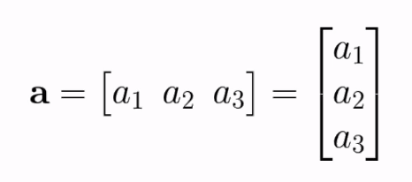

### Scalar operations

- Involve a vector and a number
- Addition/substraction/multiplication/division

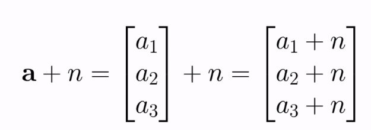

#### Vector addition/substraction

- Two vectors must have the same dimension
- Element-wise operation

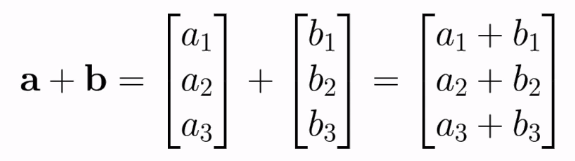

How it works

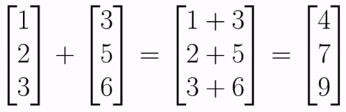

Example

#### Dot product

- Two vectors involved
- Results in a scalar

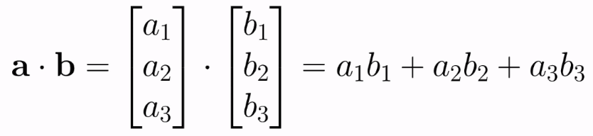

How it's done

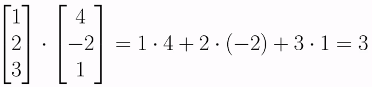

Example

### Revisiting the notation of the artificial neuron

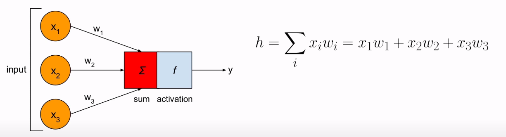

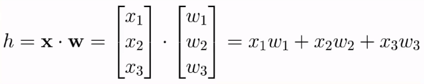

*h* can be rewritten as the dot product

- Using linear algebra for NN notation is much more elegant and clearer, that's why it's commonly used.

## Matrices

- Rectangular grid of numbers (like a spreadsheet)

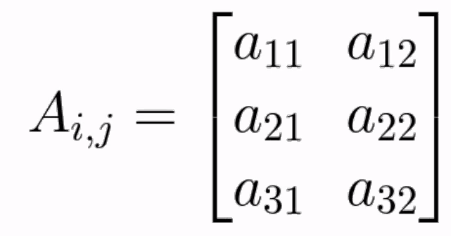

*i* represents the row indices, *j* represents the column indices

### Matrix dimensions

- Dimensions indicated by # or rows and columns

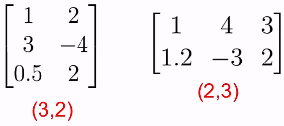

### Row and column vectors

- Row vector = (1,n) matrix
- Column vector = (n,1) matrix

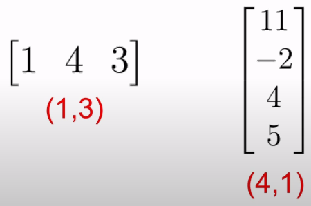

Vectors can be thought of as matrices

### Matrix transposition

- Switching rows and columns

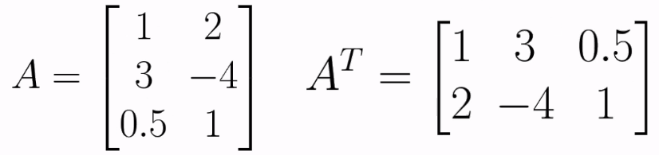

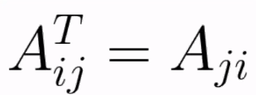

A simple/condensed manner of notating this

### Scalar operations

- Addition/substraction/multiplication/division of vector with a number

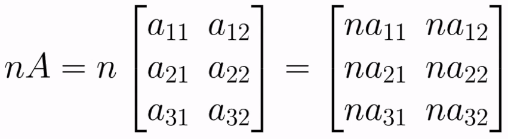

### Matrix addition/substraction

- Matrices must have same direction
- Element-wise operation

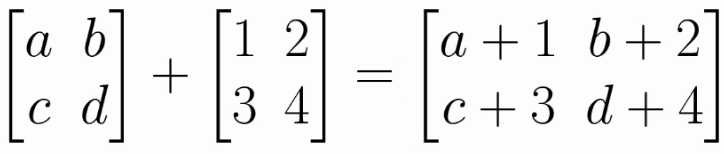

### Matrix multiplication

- \# of columns of the 1st matrix must be equal to # of rows of the 2nd
- Product of an (m,n) matrix and a (n,k) matrix is an (m,k) matrix

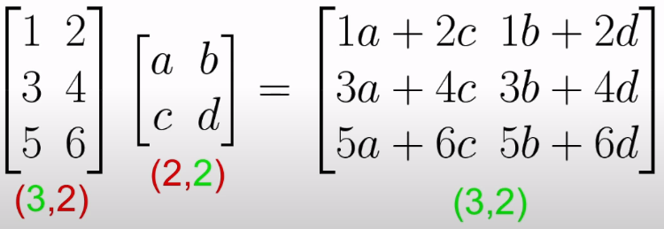

The resulting matrix has the rows of the 1st and the columns of the 2nd 

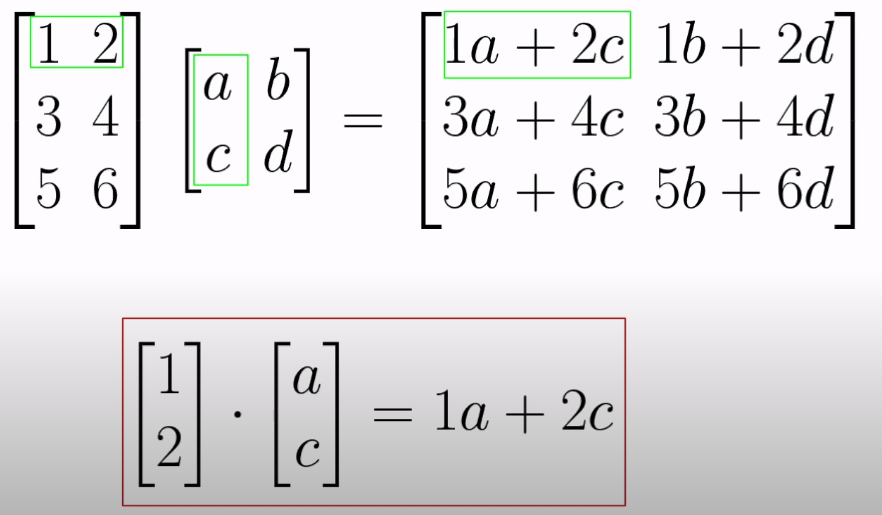

How the multiplication is performed

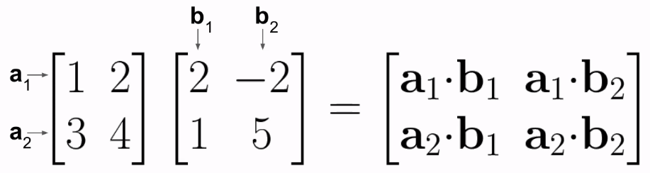

Another way to understand matrix multiplication

## Conclusion

We can use all these notations to see how a neural network performs it's computations, which will be the next topic.