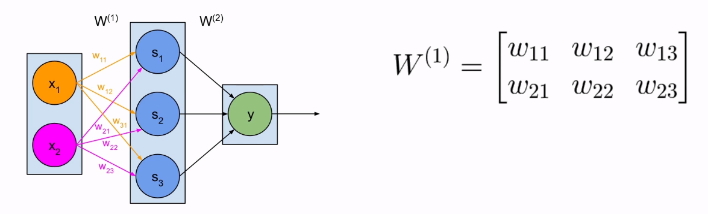

# Computation in neural networks

## The components of an artificial neural network (ANN)

- Neurons
- Input, hidden, output layers
- Weighted connections
- Activation function

### The multilayer perceptron (MLP)

### Computation in MLP

- Weights
- Net inputs (sum of weighted inputs)
- Activations (output of neurons to next layer)

Weights - represented in a matrix

Net input - with matrix multiplication

Activation formula

Computations in MLP

h = layer

W = matrix multiplication

1st layer

2nd layer

3rd layer

### Sample computation

Step 1 (1st layer) - The inputs are 0.8 and 1

Step 2 (2nd layer) - Net input by matrix multiplication

Step 3 (2nd layer) - Pass net input through activation function of choice (eg. Sigmoid in this case)

Step 4 (3rd layer) - Matrix multiplication between the activations from the 2nd layer & the weights matrix for the connections between the second and the third layers

Step 5 (3rd layer) - Pass the result through the activation function of choice (eg. Sigmoid in this case)

## Takeaway points

- ANNs work for complex problems
- Computation is distributed
- Signal moves from left to right
- Weights, net inputs and activations