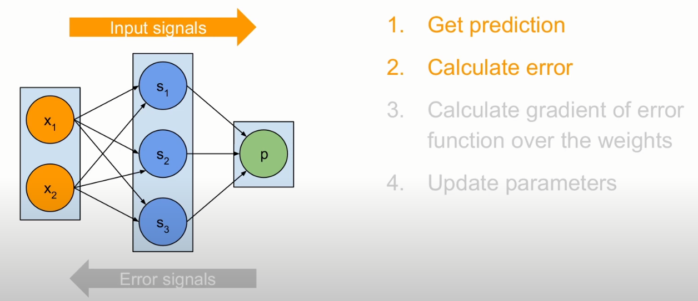
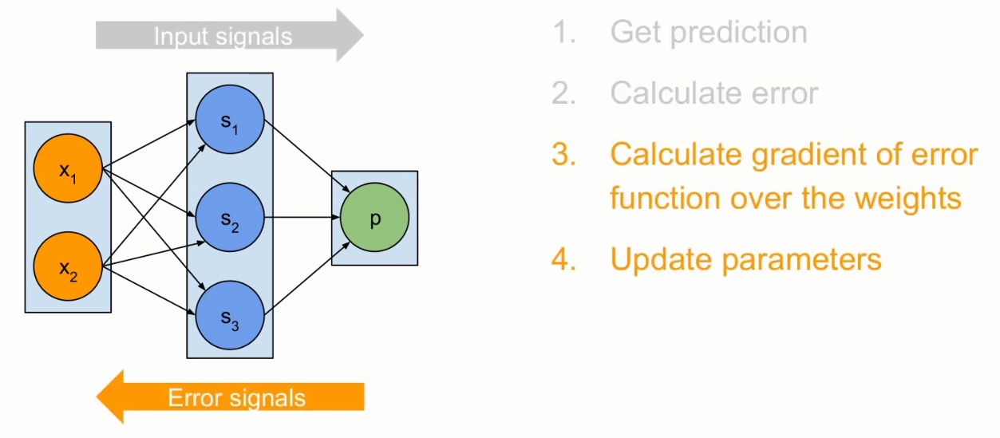
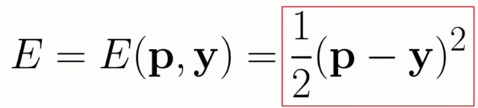
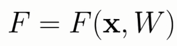
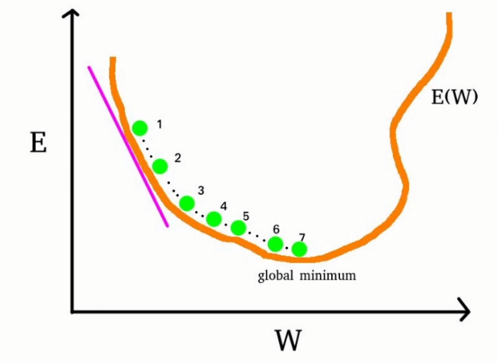

# Training a neural network: Backward propagation and gradient descent

## Training a NN

- Tweak weights of the connections
- Feed training data (input + target) to the network
- Iterative adjustments

### Forward propagation

### Back propagation

1. Make prediction

2. Calculate error

We need an error (loss) function for that.

3. Calculate gradient of the error function

We think of a NN as a very complex function which is dependant on 2 variables. The x, which is the input, and the W, which are the weights. 

The error function is a function of p and y. p, being the prediction, is a function that's the result of F(x, W). 

## Gradient descent

- Take a step in the opposite direction to gradient
- Step = Learning rate

