# Understanding audio data for deep learning

## Sound

- Produced by the vibration of an object
- Vibration determines oscillation of air molecules
- Alternation of air pressure causes a wave

## Waveform

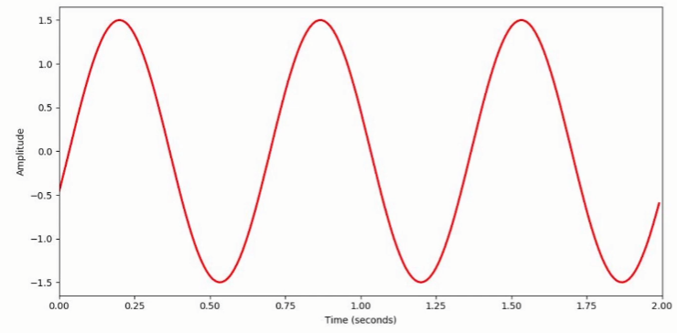

Represented with amplitude & time

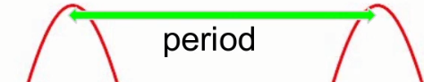

Time that passes until the same wave repeats

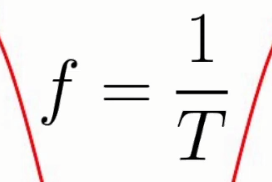

Frequency is the inverse of period.

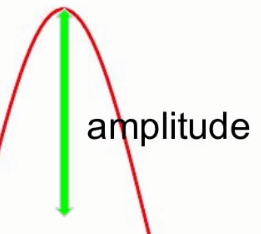

Distance from 0 amplitude

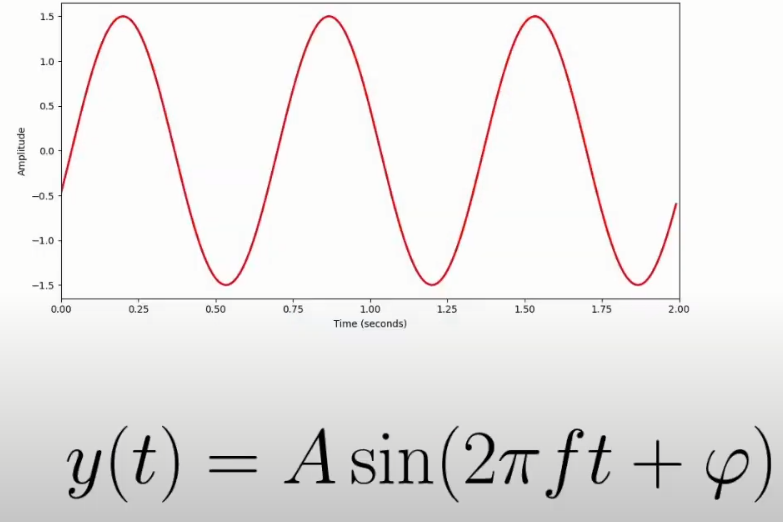

This can be represented with a sine wave

## Frequency/pitch and amplitude/loudness

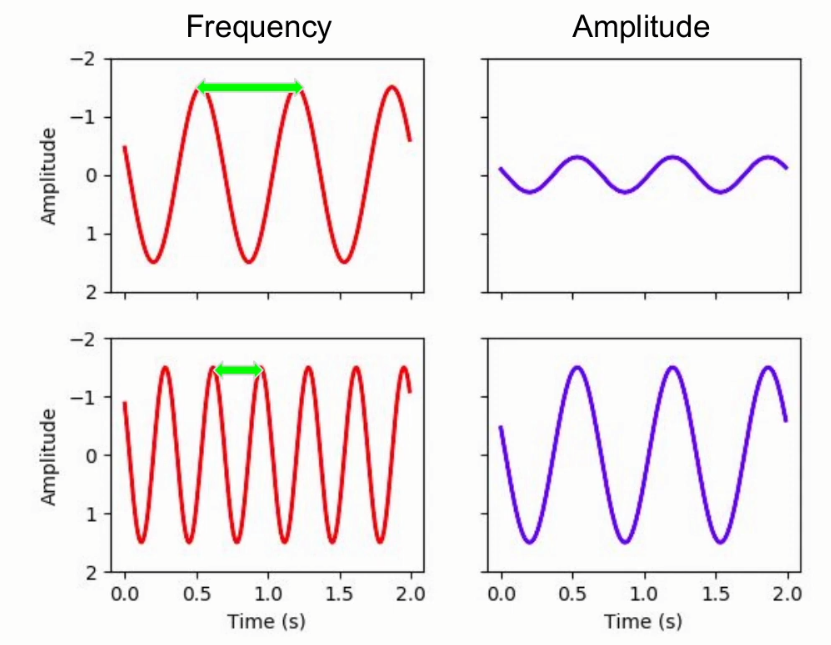

Higher frequency → Higher pitch

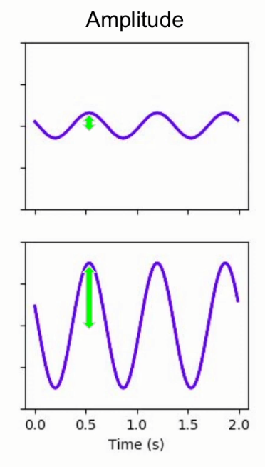

Higher amplitude → Louder

## Analog digital conversion (ADC)

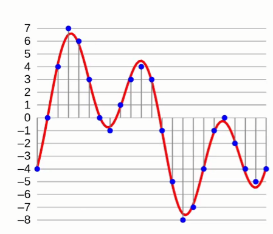

Blue point = Sample. Higher sample rate = more samples per second.

- Signal sampled at uniform time intervals
- Amplitude quantised with limited number of bits

CD:

- Sample rate = 44,100 Hz
- Bit depth = 16 bits/channel

8-bit old-school music soundtracks are called that because their bit depth is 8 bits/channel

## A real-world sound wave (piano key)

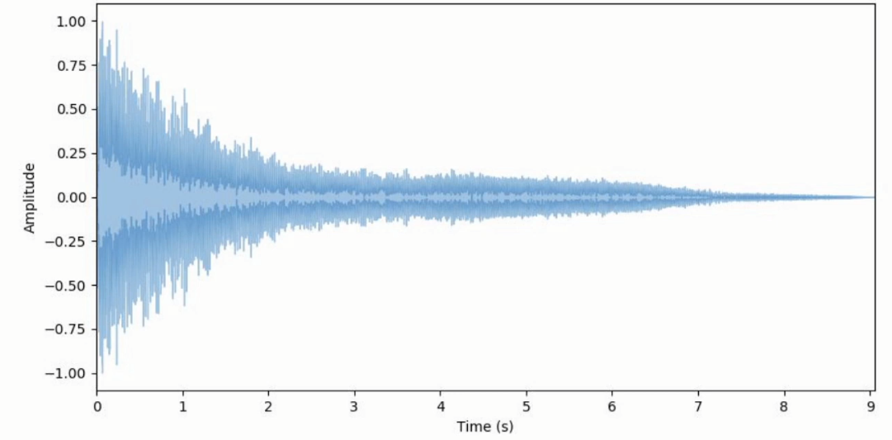

How can we learn a lot about this sound?

### Fourier transform

- Decompose complex periodic sound into sum of sine waves oscillating at different frequencies

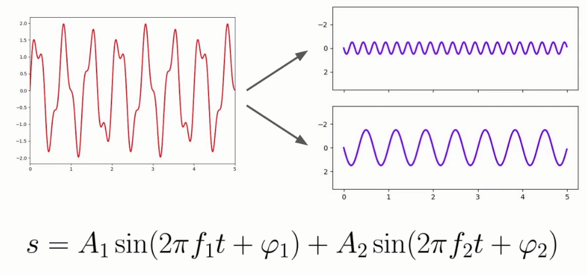

The left sound wave is a combination of these two sine waves

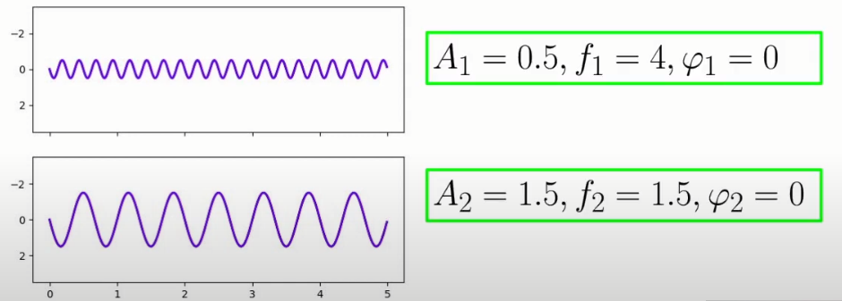

Amplitude in this case determines how much a specific sound contributes to the result. The bottom one, with 1.5 amplitude, contributes the most.

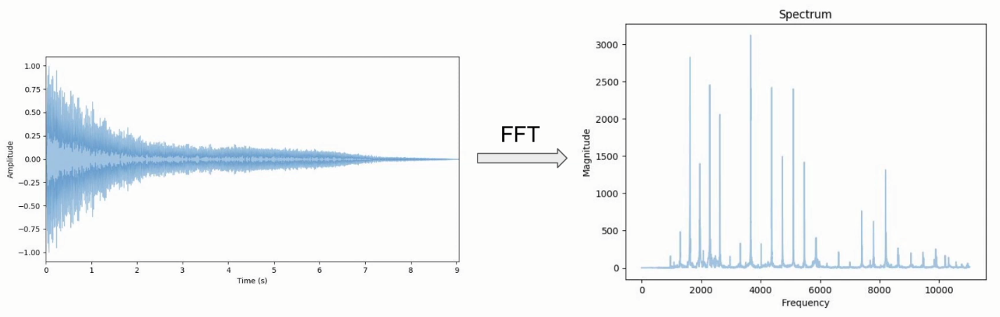

Apply fourier transform to previous example

- From *time domain* to *frequency domain*
- No time information

### Short Time Fourier Transform (STFT)

- Computes several FFT at different intervals
- Preserves time information
- Fixed frame size (e.g., 2048 samples)
- Gives a spectrogram (time + frequency + magnitude)

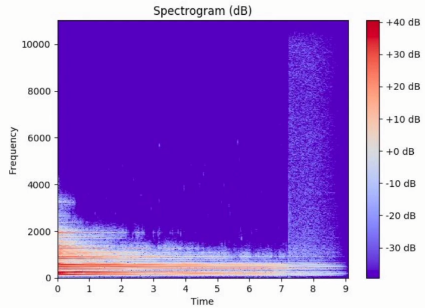

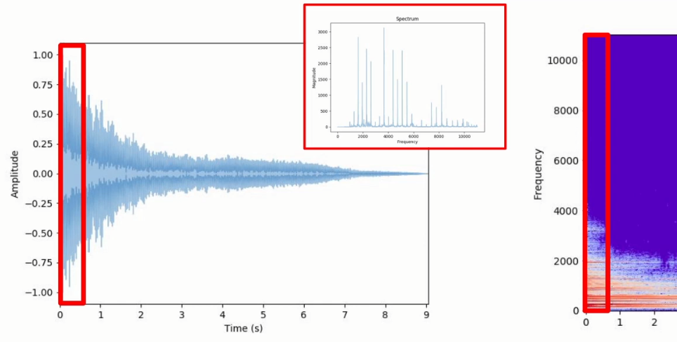

STFT is performed by focussing on one frame (number of samples) at a time. We calculate the Fourier Transform and project it onto the spectrogram.

- In the Spectrogram we use dB. With dB we apply a logarithmic function to the magnitude itself
- When we perform the Fourier Transform, what we actually perform is the FFT. Fast Fourier Transform. A variation on FT which is way faster.

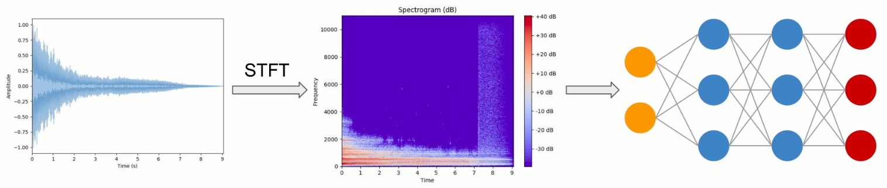

Why did we learn about spectrograms? Spectrograms are fundamental in processing audio for deep learning. It will be used as an input for our DL model

## Traditional ML pre-processing pipeline for audio data

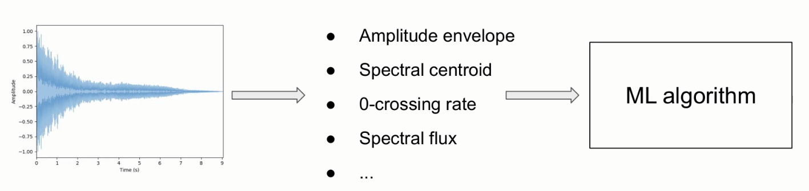

- Feature engineering
- Perform STFT
- Extract time + frequency domain features

With DL we don't need to focus that much on feature engineering, we can just use the spectrogram.

## Mel Frequency Cepstral Coefficients (MFCCs)

- Capture timbral/textural aspects of sound
- Frequency domain feature
- Approximate human auditory system
- 13 to 40 coefficients
- Calculated at each frame

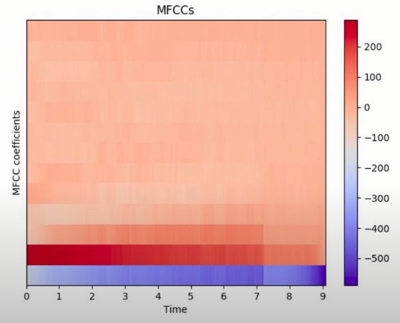

Representation of an MFCC

### MFCCs applications

- Speech recognition
- Music genre classification
- Music instrument classification
- ...

We don't need the mathematical and theoretical information about MFCCs and STFT for DL.

### DL Pre-processing pipeline for audio data

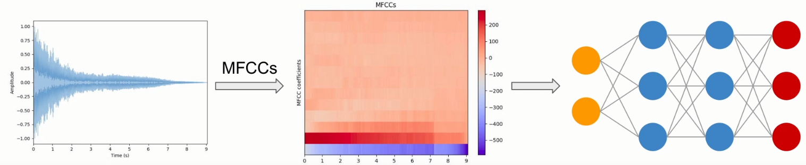