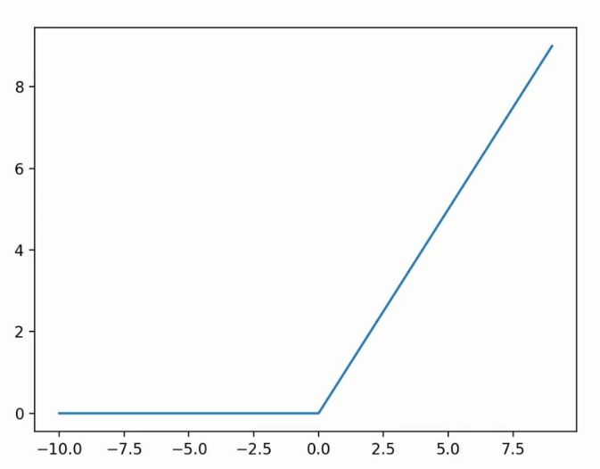
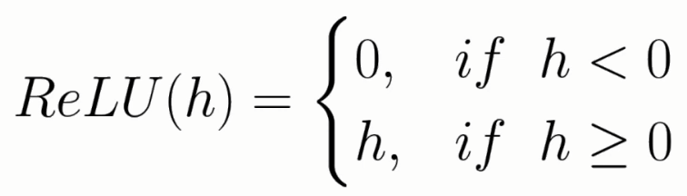

# Implementing a neural network for music genre classification

## Rectified Linear Unit (ReLU)

### Why use ReLU?

- Better convergence
- Reduced likelihood of *vanishing gradient*

## Types of batching

- Stochastic
    - Calculate gradient on 1 sample
    - Quick, but inaccurate
- Full batch
    - Compute gradient on the whole training set
    - Slow, memory intensive, accurate
- Mini-batch
    - Compute gradient on a subset of data set (16-128 samples)
    - Best of the 2 worlds