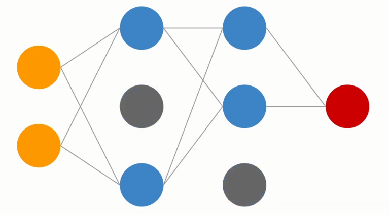

# Solving overfitting

## Ways to solve overfitting

- Simpler architecture
- Data augmentation
- Early stopping
- Dropout
- Regularization

### Simpler architecture

The more complex the architecture, the more the model is going to actually interpret all the patterns and learn everything, maybe even beyond what is generalizable. Also the artifacts and the nuances of the training set itself.

- Remove layers
- Decrease # of neurons
- No universal rule ☹️

### Data augmentation

The idea behind data augmentation is the more data you have, the better your model is going to perform, also on data it has never seen.

- Artificially increase # of training samples
- Apply transformations to **train set**
    - For CV:
        - Scaling
        - Stretching
        - Flipping
        - ...
    - For audio
        - Pitch shifting
        - Time stretching
        - Adding background noise
        - ...

### Early stopping

- Choose certain rules to stop training

In the above image, we are saying: If the test error isn't improving by x after 7 iterations, then just stop the training.

### Dropout

In the above image, the grey neurons have been dropped, so the training continues only in the remaining part of the network.

In the above image, for the second batch of data, another neuron has been dropped. 

Which neurons to drop is decided randomly (stochastically). 

Why does this work?

If we do this, we increase the network robustness, because the network can't rely on certain neurons too much. So all the neurons have to have some responsibility for the prediction process. None can be indispensable.

- Randomly drop neurons while training
- Increased network robustness
- Dropout probability: 0.1 - 0.5 % → Depends on problem

### Regularization

- Add penalty to error function
- Punish large weights
- L1 and L2

### L1 regularization

- Minimises absolute value of weights
- Robust to outliers
- Generates simple model

### L2 regularization

- Minimises squared value of weights
- Not robust to outliers
- Learns complex patterns

Which one should you use?

This can be described as more of an art than a science... We are not sure. The best rule of thumb goes as follows:

If you have "simple to train" data, you should probably go with L1. On the other hand, if your data is more complex, go with L2. 

With most audio and music based DL tasks you usually want to use L2 regularization.