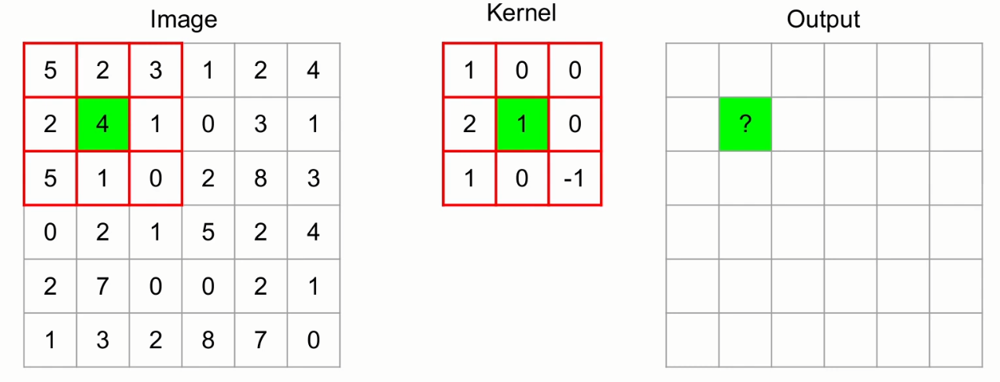

# Convolutional Neural Networks Explained

## CNNs

- Mainly used for processing images
- Perform better than multilayer perceptron
- Less parameters than dense layers

## Intuition

- Image data is structured
    - Edges, shapes
    - Translation invariance
    - Scale invariance
- CNN emulates human vision system
- Components of a CNN learn to extract different features

## CNN components

- Convolution
- Pooling

## Convolution

- Kernel = grid of weights
- Kernel is "applied" to the image
- Traditionally used in image processing

These values represent the values for each pixel. You could imagine each value representing something between 0 and 256, 256 being black and 0 being white in this case.

We overlay the kernel on top of the image. We center it around the kernel and we focus on the center pixel in the kernel. We get a value from the convolution which is input in this output grid, which is at the same index of the original image where we've centered the kernel on.

How do we get the value?

We apply the dot product, by taking each value of the image where the kernel is overlayed and multiply it by each corresponding value in the kernel, and add it all up. 

So for example, 5 (top left image) * 1 (top left kernel), plus 2 (middle left image) * 0 (middle left kernel) plus etc...

The value, in this case 18, is inserted in the output grid.

What happens now? 

We slide the "sliding window" (kernel) over to the right. We move on and do the same again. 

And we slide again

And again

And then we go down.

We continue like this until we have all the outputs!

But we only have the values of the convolution only for the internal squares, not on the edges...

If we center the kernel on the (0,0) index we cannot apply the math since we don't have values on those edges. So what can we do about it?

### Zero padding

One of the solutions usually used in DL is: we come up with an artificial edge that has all 0's. Then all of the sudden we can perform the convolution also on the edges of the image. This is called zero padding.

## Kernel

- Feature detectors
- Kernels are learned

Kernels should be thought of as feature detectors.

For CNN's we extract features using these kernels. The cool thing is that the kernels are learned in the process, so they are not hard coded.

What does it mean to learn a kernel?

We learn all the values in the kernel. So when we train a CNN it's basically learning all the values in the kernel.

## Architectural decisions for convolution

- Grid size
- Stride
- Depth
- Number of kernels

### Grid size

- # of pixels for height/width
- Odd numbers

We use grid sizes with odd numbers because when we have odd numbers we have a central value.

You will usually also see squared kernels, but it is possible to also use rectangular kernels.

### Stride

- Step size used for sliding kernel on image
- Indicated in pixels

Stride of 1 (moving one pixel at a time)

Stride of 2 would be moving 2 pixels at a time.

You can specify both the horizontal and vertical stride. So when you arrive on the edge of an image, how many pixels down will you move?

Stride does not necessarily need to be the same for horizontal and vertical values. But usually the same is used.

### Depth

This setting is more constraint. The idea is that if you have a greyscale image, the depth is 1. But if you have a color image, each pixel for a color image has 3 values, one for R, one for G and one for B. The kernel is also divided into 3 paths. We have a grid for the R, one for G and one for B. And these are independent. 

So a kernel for a RGB is 3x3x3. 3x3 are the width and height, and the third dimension is one for R, one for G and one for B. 

The weights in the image above is 27, because it's 3x3x3.

- For RGB data, we will have 3D arrays.
- Depth is also called channels. Because in RGB images they are usually called color channels

### # of kernels

- A convolutional layer has multiple kernels
- Each kernel outputs a single 2D array
- Output from a layer has as many 2d arrays as # kernels.

# Pooling

We have looked at convolution, now let's look at the other part of CNN's.

- **Downsample the image**
    
    Basically shrinking an image
    
- Overlaying grid on image
- **Max / average pooling**
    
    In DL max pooling is the standard
    
- No parameters

## Pooling settings

- Grid size
- Stride
- Type (e.g., max, average)

## Max pooling (2x2, stride 2)

We can imagine that the input is an image. 

Given that we are max pooling, we just take the greatest value of the overlayed grid (which is 2x2 in this case) and we log it in the output.

So we are downsampling the original input.

In this case, since the stride is 2, we slide the grid 2 pixels to the right.

There is obviously a mathematical relationship between the size of the output, the size of the input, the stride and the grid size.

In this case where we have a 2x2 max pooling grid, with stride 2, we are basically halving the width and the height of the input.

# CNN architecture

Looking at the feature learning segment:

At each convolution we are trying to extract features. At the beginning we extract very low level features. But then moving forward, we can leverage those edges to find shapes. Then going even deeper we can arrive at objects.

The more to the right you go, the higher level features are extracted.

## How does convolution/pooling apply to audio?

- Spectrogram/MFCC = image
- Time, frequency = x, y
- Amplitude = pixel value

## Preparing MFCCs for a CNN

- 13 MFCCs
- Hop length = 512 samples
- \# samples in audio file = 51200

Question: What is the data shape that we expect our CNN to be fed with?

Answer: Data shape = 100 x 13 x 1

100 → Samples divided by hop length

13 → 13 MFCCs

1 → Depth equal to 1. Audio data can be compared to greyscale images, where the depth is 1.

Why use the 1 depth? Well, CNNs are supposed to work with images, which usually have color channels, so depth is very important.

This data shape is what TensorFlow is going to accept for learning purposes.